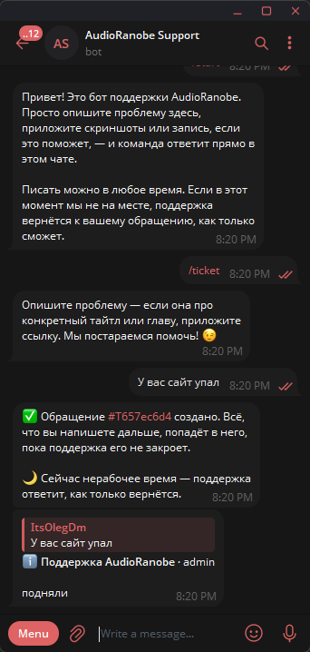
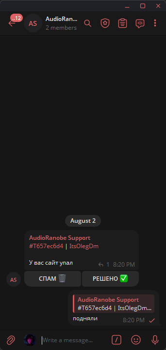

# Ticketgram — AudioRanobe support bot
A Telegram support bot for AudioRanobe. Readers write to it in a private chat,
the support team answers from one shared supergroup, and each exchange is
tracked as a ticket.

Based on [ticketgram](https://github.com/mikurei/ticketgram) by mikurei (GPLv3).
What this fork changes:

- Russian out of the box, and the catalog is actually loaded (upstream resolved
  the locale directory relative to the working directory, so in the container it
  silently fell back to English)
- SQLite lives in `ticketgram/data/` next to the code — no named Docker volume
- Prometheus instrumentation removed
- **One open ticket per reader**, and every message they send joins it until
  support closes it — instead of a `/ticket` conversation that produced a
  separate ticket per question
- **Any message type** relayed in both directions: photos, documents, voice,
  video notes, stickers
- Every relayed message tagged with the ticket's hashtag
- Working hours are no longer displayed to readers

# Features
- One running conversation per reader — no juggling several tickets at once
- Any message type relayed both ways: photos, files, voice, video notes, stickers
- Every relayed message tagged with the ticket's hashtag, so the whole thread is one search away
- Anonymous (pseudonym system)
- Configurable
- Dockerized
- Russian out of the box (`ru`), English available via `BOT_LANGUAGE=en`
- Access control

# How a ticket works
1. A reader writes to the bot. Their **first message opens a ticket** and the
   bot confirms it with the ticket's tag, e.g. `#T3f9a1c04`. If it is outside
   the working window, the confirmation also says support will answer once
   they are back — no clock or schedule is shown to the reader.
2. **Every message after that joins the same ticket.** There is no command to
   run and no way to open a second one in parallel; whatever they send lands
   in the open ticket until support closes it.
3. In the support group each relayed message is posted under a header of the
   form `#T3f9a1c04 | <reader>`. Tapping the tag — or searching it — brings up
   the whole conversation. The tag also works as a target for `/ban` and
   `/unban`, with or without the leading `#`.
4. Staff answer by **replying** to any of the bot's messages in that thread.
   The answer is delivered to the reader as a reply to the message it
   addresses, signed with the staff member's pseudonym. Replying does *not*
   close the ticket.
5. If the reader replies to an answer, the bot posts their message into the
   group **as a reply to that staff message**, so the back-and-forth keeps its
   shape on both sides.
6. **CLOSE ✅** ends the ticket and tells the reader so; their next message
   opens a fresh one. **SPAM 🗑️** bans the reader and deletes the ticket's
   messages from the group.

Stickers, video notes and other media Telegram will not attach a caption to are
posted as a tagged header with the media immediately below it, since there is
no way to put text on the media message itself.

## Gallery

|User-side|Support-side|
|-|-|
|||

See more at [Screenshots](screenshots/SCREENSHOTS.md)

# Uses
- `Python 3.11`
- `python-telegram-bot` Telegram Bot HTTP API wrapper (that you can't refuse)
- `peewee` as an ORM
- `babel` for localization (build-time only — the bot reads the compiled `.mo`)
- `SQLite` as a database, stored in `ticketgram/data/`

# Layout
```
ticketgram/
|  data/                  | SQLite database (bind-mounted in Docker)
|  src/
|  |  bot.py              | Entry point, handler wiring
|  |  callbacks.py        | Handlers for both sides of the conversation
|  |  config.py           | Environment variables, path resolution
|  |  models.py           | peewee tables
|  |  templates.py        | Reader-facing message templates
|  |  utils.py            | Ticket tags, working hours, summaries
|  |  services/
|  |  |  relay.py         | Copies messages between the two chats
|  |  |  ticket.py        | Ticket lifecycle + message mapping
|  |  |  user.py          | Bans
|  |  |  bot.py           | Startup checks, command menu
|  |  locales/            | Message catalog
```

## Data model
|Table|Holds|
|-|-|
|`users`|Everyone who has ever contacted the bot|
|`employees`|Staff pseudonyms|
|`support_tickets`|One row per ticket; `status` is what "open" means|
|`ticket_messages`|Both message ids of every relayed message, in either direction|

`ticket_messages` is what makes replies routable: a reply in the group is
matched by `support_message_id` to find the ticket, and a reply in the private
chat is matched by `private_message_id` to find the staff message to answer
under. It is created automatically on startup, so an existing database picks it
up with no migration — but tickets opened before this change have no rows in it
and replies to them will not route. Close those out.

# Commands
Client-side:
- `/start` Welcome message
- `/ticket` Explains how to reach support — a ticket is opened by simply writing, not by this command

Support-side:
- `/open` View open tickets
- `/ban` Ban the user (accepts `#T3f9a1c04`, `@username` or a user id)
- `/unban` Unban the user
- `/pseudonym` Set pseudonym

# Usage
## Prerequisites
1. Bot account
   1. Start the [@BotFather](https://t.me/BotFather)
   2. Type the `/newbot` command
   3. Follow the instructions to get your own bot and `TELEGRAM_TOKEN`
2. Supergroup
   1. Create a regular private group
   2. Upgrade it to a supergroup (for example, by changing the visibility of `chat history for new members`) [1]
3. `chat_id` of the supergroup
   1. Invite the bot to the supergroup
   2. You will see that the bot automatically leaves from unauthorized groups.
   3. Notice the log line `... | INFO | callbacks::leave_chat (...) | Chat is not authorized: 'chat_id'`, where `chat_id` is supergroup id
   > ℹ️ Optionally, use a bot or a custom telegram client of your choice that gives you `chat_id` of the group, for example [@getidsbot](https://t.me/getidsbot)

[1] - Learn more about supergroup triggers here: https://stackoverflow.com/a/62291433

# Installation
> ⚠️ `pyproject.toml` pins `python = "~3.11"` and `requirements.txt` carries
> hashes scoped to 3.11, so `pip install -r requirements.txt` refuses to run on
> 3.12+. Docker uses `python:3.11-slim` and is unaffected.

## Using Poetry (recommended)
```bash
poetry install
poetry shell
```

## Using pip
```bash
pip install -r requirements.txt
```

# Launch
Copy `src/.env_example` to `src/.env` and fill in `TELEGRAM_TOKEN` and
`AUTHORIZED_GROUP_ID`, then:

```bash
python src/bot.py
```

Environment variables set in the shell take precedence over `src/.env`. The bot
resolves its own directory from `config.py`, so it can be started from anywhere.

# Deploy using Docker
```bash
docker compose up -d --build
```

`docker-compose.yml` bind-mounts `./data` into the container, so the SQLite
database stays in `ticketgram/data/tickets.db` on the host — no named volumes to
hunt down when you want to back it up or inspect it.

Plain `docker run` equivalent:
```bash
docker run -d --env-file ./src/.env -v "$(pwd)/data:/app/data" ticketgram
```

# Configuration
Bot is configured using the `Environment Variables` (or `src/.env`).

|Name|Description|
|-|-|
|TELEGRAM_TOKEN|**Required** bot token to access the HTTP Bot API|
|AUTHORIZED_GROUP_ID|**Required** group in which the bot operates|
|BOT_LANGUAGE|*Optional* Language of the bot's messages. Defaults to `"ru"`|
|DB_URI|*Optional* SQLite path. Relative paths are resolved inside `ticketgram/data/`. Defaults to `"tickets.db"`|
|BOT_TIME_ACTIVE|*Optional* Working hours. Never shown to readers — they only decide whether a new ticket gets the "we'll answer once we're back" notice. Defaults to `"10:00-20:00"`|
|BOT_TIME_ZONE|*Optional* Timezone the working hours are given in. Defaults to `"+3"` (Moscow)|
|BOT_ACTIVE_DAYS|*Optional* Working days, same purpose as `BOT_TIME_ACTIVE`. Defaults to `"monday tuesday wednesday thursday friday saturday sunday"`|

`USER_OPEN_TICKETS_MAX` and `PROMETHEUS_ENABLED` / `PROMETHEUS_PORT` are gone.
They are ignored if still present in your `.env`.

To change the welcome and support reply messages, review the `templates.py`
module — and remember that the Russian wording lives in the catalog, not in
`templates.py` (see [Localization](#localization)).

# Localization
Project uses [GNU gettext](https://docs.python.org/3/library/gettext.html) and [Babel](https://babel.pocoo.org/en/latest/index.html) utilities for internationalization.
```
locales/                | Message catalog
|  LANGUAGE_CODE/       | Concrete translation
|  |  LC_MESSAGES/      |
|  |  |  base.mo        | Compiled translation file
|  |  |  base.po        | Translation file
|  base.pot             | Template translation file
```

The strings in the Python source are the English originals and double as
lookup keys; `ru_RU/LC_MESSAGES/base.po` holds the Russian the bot actually
sends. **Editing a string in the source changes the key**, so the matching
`msgid` in `base.po` (and `base.pot`) has to be updated and the catalog
recompiled, otherwise that message silently falls back to English.

After touching any `_("...")` string:
```bash
pybabel extract -o src/locales/base.pot src/
pybabel update -i src/locales/base.pot -d src/locales -D base
# fill in the new msgstr values in src/locales/ru_RU/LC_MESSAGES/base.po
pybabel compile -d src/locales -D base
```

## Adding a new language
1. Create a new language directory under the `locales/`, for example `ja_JP/`
2. Create `LC_MESSAGES/` in new language directory
3. Copy the `base.pot` from `locales/` folder into `LC_MESSAGES` and rename it to `base.po`
4. Translate the strings to desired language
   - `msgid` key is original string
   - `msgstr` key is translated string
5. Compile the `base.po` to `base.mo` either using `pybabel compile` or `msgfmt` (Linux/WSL only)

___
*Upstream project by [mikurei](https://github.com/mikurei) 2023*
